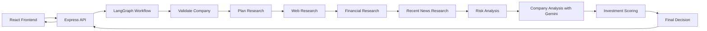

# InsideIIM AI Investment Research Agent 🤖📈

An end-to-end AI investment research application that lets a user enter a company name and receive a structured investment report with an **INVEST** or **PASS** decision.

The project is built as a hybrid system:
- real web research for current information,
- structured financial data when available,
- deterministic scoring for consistency,
- Gemini for reasoning and narrative analysis,
- LangGraph to orchestrate the workflow step by step.

## What the app does

The user enters a company name in the React frontend. The backend then runs a research workflow that:

1. validates the company name,
2. builds a research plan,
3. collects web context,
4. collects financial data,
5. checks recent news,
6. analyzes risk,
7. analyzes the company with Gemini,
8. scores the opportunity,
9. returns a final decision and investment thesis.

## Tech Stack

### Frontend
- React 19
- Vite
- Tailwind CSS 4

### Backend
- Node.js
- Express.js
- LangGraph.js
- Zod

### AI and Research
- Gemini API
- Tavily Search API
- Alpha Vantage API

## High-Level Architecture



## Folder Structure

```text
InsideIIM/
├── Backend/
│   ├── src/
│   │   ├── app.js
│   │   ├── server.js
│   │   ├── config/
│   │   ├── controllers/
│   │   ├── routes/
│   │   ├── middlewares/
│   │   ├── schemas/
│   │   ├── services/
│   │   │   ├── agent/
│   │   │   ├── alphaVantage.service.js
│   │   │   ├── gemini.service.js
│   │   │   ├── riskAnalysis.service.js
│   │   │   └── tavily.service.js
│   │   ├── constants/
│   │   ├── models/
│   │   └── utils/
│   ├── .env.example
│   └── package.json
├── Frontend/
│   ├── src/
│   │   ├── App.jsx
│   │   ├── App.css
│   │   ├── index.css
│   │   └── services/
│   ├── .env.example
│   └── package.json
└── README.md
```

## Backend Architecture

The backend is designed as a clean, modular API rather than a single large controller.

### Main backend layers
- `src/server.js` starts the HTTP server.
- `src/app.js` sets up middleware and routes.
- `src/routes/` defines API routes.
- `src/controllers/` handles incoming requests and response shaping.
- `src/services/` contains external API adapters and business logic.
- `src/services/agent/` contains the LangGraph workflow, graph state, and node implementations.
- `src/middlewares/` contains centralized error handling.
- `src/schemas/` validates request data and structured outputs.

### LangGraph workflow
The research graph currently follows this sequence:

- Validate Company
- Plan Research
- Web Research
- Financial Research
- Recent News Research
- Risk Analysis
- Company Analysis
- Investment Scoring
- Final Decision

### Why this architecture
This structure keeps the app interview-friendly and maintainable:
- each research step is isolated,
- external APIs are wrapped in services,
- deterministic scoring is separated from AI reasoning,
- the final response is structured JSON,
- missing APIs fail gracefully instead of crashing the whole workflow.

## Frontend Overview

The frontend is a polished research console where the user can:
- enter a company name,
- use sample company shortcuts,
- see workflow progress,
- view the final report,
- inspect confidence, overall score, strengths, risks, and sources.

The frontend sends requests to the backend API and renders the final investment report in a clean dashboard UI.

## Core API Endpoint

### `POST /api/research`

Request body:
```json
{
  "companyName": "Tata Consultancy Services"
}
```

Example response:
```json
{
  "company": "Tata Consultancy Services",
  "decision": "INVEST",
  "confidence": 82,
  "overallScore": 8.2,
  "scores": {
    "financialHealth": 9,
    "growthPotential": 8,
    "marketPosition": 9,
    "riskLevel": 7
  },
  "companyOverview": "...",
  "strengths": [],
  "risks": [],
  "recentDevelopments": [],
  "investmentThesis": "...",
  "sources": []
}
```

## Environment Variables

### Backend `Backend/.env`

```bash
PORT=5000
CLIENT_ORIGIN=http://localhost:5173
TAVILY_API_KEY=
TAVILY_BASE_URL=https://api.tavily.com
ALPHAVANTAGE_API_KEY=
ALPHAVANTAGE_BASE_URL=https://www.alphavantage.co/query
GEMINI_API_KEY=
GEMINI_MODEL=gemini-2.0-flash
GEMINI_BASE_URL=https://generativelanguage.googleapis.com/v1beta
```

### Frontend `Frontend/.env`

```bash
VITE_API_BASE_URL=http://localhost:5000
```

## Getting Started

### 1. Install backend dependencies

```bash
cd Backend
npm install
```

### 2. Install frontend dependencies

```bash
cd Frontend
npm install
```

### 3. Configure environment variables

Create a `.env` file in both `Backend/` and `Frontend/` using the sample values above.

### 4. Run the backend

```bash
cd Backend
npm run dev
```

### 5. Run the frontend

Open a second terminal:

```bash
cd Frontend
npm run dev
```

## Current Status

The project currently includes:
- a working React frontend,
- an Express backend,
- a LangGraph workflow skeleton,
- Tavily integration for web research,
- Alpha Vantage integration for financial data,
- Gemini-based company analysis via direct REST calls,
- deterministic scoring and final decision logic,
- graceful fallback behavior when API keys are missing.

## Engineering Decisions

### Hybrid intelligence model
The app does not rely on Gemini alone. It combines:
- real data retrieval,
- deterministic calculations,
- AI reasoning for narrative analysis.

### Graceful degradation
If an external API key is missing or a provider fails, the workflow still completes and records the issue in the response instead of crashing.

### Structured output
The final response is JSON-first so the frontend can render it reliably and the project stays easy to extend.

### Optional persistence
MongoDB is intentionally left out for now because research history is not essential to the core assignment.

## What You Can Say in an Interview

- I built an agentic research workflow instead of a single prompt wrapper.
- I used LangGraph to manage state across research stages.
- I separated data retrieval, reasoning, scoring, and presentation.
- I used deterministic scoring where AI should not be doing arithmetic.
- I designed the system so it can fail gracefully when external APIs are unavailable.
- I kept the architecture modular so each node can be tested and explained independently.

## Notes

- Tavily and Alpha Vantage are optional at runtime, but the workflow becomes more useful when their keys are configured.
- Gemini is used for company analysis and narrative reasoning.
- The backend is already structured to support future improvements like MongoDB research history, auth, caching, and progress streaming.

## Status

This project is currently in an interview-ready prototype stage. The full workflow and UI are implemented, and the next natural improvements would be richer financial scoring, streaming progress updates, and optional persistence.
